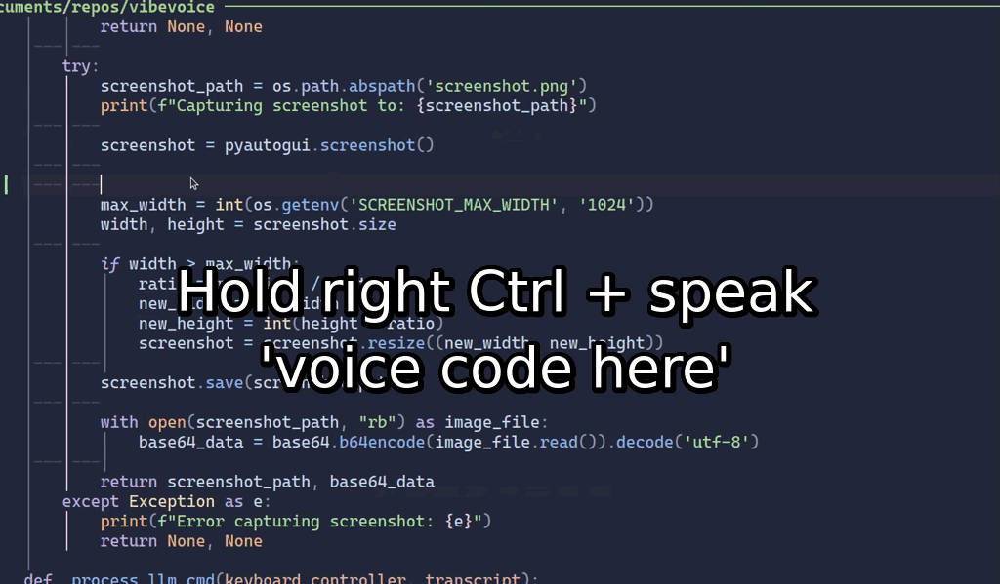

# Vibevoice 🎙️

Hi, I'm [Marc Päpper](https://x.com/mpaepper) and I wanted to vibe code like [Karpathy](https://x.com/karpathy/status/1886192184808149383) ;D, so I looked around and found the cool work of [Vlad](https://github.com/vlad-ds/whisper-keyboard). I extended it to run with a local whisper model, so I don't need to pay for OpenAI tokens.
I hope you have fun with it!

## What it does 🚀



Simply run `cli.py` and start dictating text anywhere in your system:
1. Hold down right control key (Ctrl_r)
2. Speak your text
3. Release the key
4. Watch as your spoken words are transcribed and automatically typed!

Works in any application or window - your text editor, browser, chat apps, anywhere you can type!

NEW: LLM voice command mode:

1. Hold down the scroll_lock key (I think it's normally not used anymore that's why I chose it)
2. Speak what you want the LLM to do
3. The LLM receives your transcribed text
4. The LLM answer is typed into your keyboard (streamed)

Works everywhere on your system

## Installation 🛠️

```bash
git clone https://github.com/mpaepper/vibevoice.git
cd vibevoice
pip install -r requirements.txt
python src/vibevoice/cli.py
```

## Requirements 📋

### Python Dependencies
- Python 3.12 or higher

### System Requirements
- CUDA-capable GPU (recommended) -> in server.py you can enable cpu use
- CUDA 12.x
- cuBLAS
- cuDNN 9.x
- [Ollama](https://ollama.com) for AI command mode

#### Setting up Ollama
1. Install Ollama by following the instructions at [ollama.com](https://ollama.com)
2. Pull a model for text processing:
   ```bash
   ollama pull gemma3:27b  # Great model which can run on RTX 3090 or similar
   ```
3. Make sure Ollama is running in the background:
   ```bash
   ollama serve
   ```

#### macOS Requirements

* CUDA-capable GPU recommended for best performance
* For CPU-only mode, modify server.py accordingly

## Usage 💡

1. Start the application:
```bash
python src/vibevoice/cli.py
```

2. Hold down right control key (Ctrl_r) while speaking
3. Release to transcribe
4. Your text appears wherever your cursor is!

### Configuration

You can customize various aspects of VibeVoice with the following environment variables:

#### Keyboard Controls
- `VOICEKEY`: Change the dictation activation key (default: "ctrl_r")
  ```bash
  export VOICEKEY="ctrl"  # Use left control instead
  ```
- `VOICEKEY_CMD`: Set the key for AI command mode (default: "scroll_lock")
  ```bash
  export VOICEKEY_CMD="ctsl"  # Use left control instead of Scroll Lock key
  ```

#### AI Features
- `OLLAMA_MODEL`: Specify which Ollama model to use (default: "gemma3:27b")
  ```bash
  export OLLAMA_MODEL="gemma3:4b"  # Use a smaller model in case you have less GPU RAM
  ```


## Usage Modes 💡

VibeVoice supports two modes:

### 1. Dictation Mode
1. Hold down the dictation key (default: right Control)
2. Speak your text
3. Release to transcribe
4. Your text appears wherever your cursor is!

### 2. AI Command Mode
1. Hold down the command key (default: Scroll Lock)
2. Ask a question or give a command
3. Release the key
4. The AI will analyze your request and type a response

## Credits 🙏

- Original inspiration: [whisper-keyboard](https://github.com/vlad-ds/whisper-keyboard) by Vlad
- [Faster Whisper](https://github.com/guillaumekln/faster-whisper) for the optimized Whisper implementation
- Built by [Marc Päpper](https://www.paepper.com)
